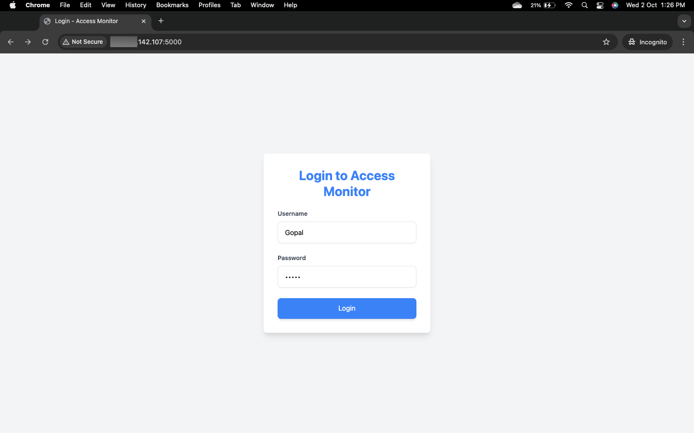
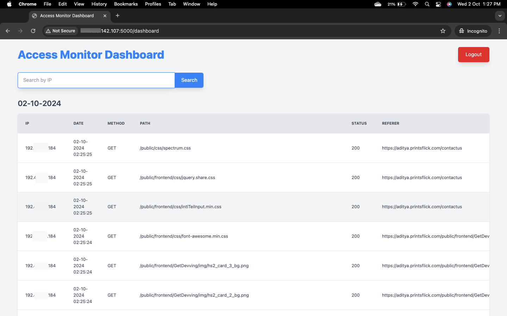

# Access Monitor Dashboard

This project is a Flask-based web application that monitors Apache access logs. The application features a login page for authentication and a dashboard that displays log entries, search functionality by IP, and visual data representation using charts.

## Features

- **User Authentication:** Admin login functionality.
- **Access Log Parsing:** Parses Apache access logs and displays them in a readable format.
- **Search by IP:** Search logs by IP address.
- **Date-wise Segregation:** Logs are displayed and grouped by date for easier navigation.
- **Dynamic Updates:** The dashboard dynamically fetches updated logs every 30 seconds.
- **Data Visualization:** Log data is visualized using charts for better monitoring and analysis.
  
## Technology Stack

- **Backend:** Flask, Python
- **Frontend:** TailwindCSS
- **Containerization:** Docker
- **Logging Service:** Apache Access Logs

## Setup and Installation

### Prerequisites
- Docker
- Python 3.9

### Installation Steps

1. Clone the repository:
   ```bash
   git clone (https://github.com/prasadzagade/access-monitor-dashboard-.git)
   cd flask-devops-project
   ```

2. Create a `.env` file with the necessary environment variables.

3. Build and run the Docker container:
   ```bash
   docker-compose up -d --build
   ```

4. Access the application at `http://localhost:5000`.

## Application Screenshots

### Login Page


### Dashboard


## Usage

### Log in to the Dashboard
- Navigate to the login page.
- Use the default credentials: 
  - **Username:** `admin`
  - **Password:** `admin`

### Monitor Logs
- View logs by date in the dashboard.
- Search logs by IP address for detailed information.
- The dashboard will automatically update with new logs every 30 seconds.

## File Structure

```plaintext
.
├── app
│   ├── log_parser.py  # Contains the logic to parse Apache logs
│   ├── main.py        # Flask application logic
│   └── templates
│       ├── dashboard.html  # HTML template for the dashboard
│       └── login.html      # HTML template for the login page
├── docker-compose.yml   # Docker configuration
├── Dockerfile           # Dockerfile for building the application container
├── logs                 # Directory for logs (if any / optional)
└── requirements.txt     # Python dependencies
```
